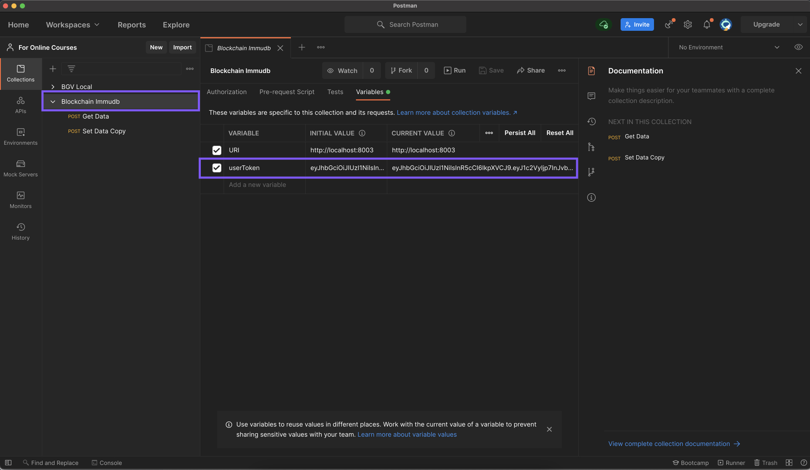

## Learning immudb - Node SDK

This mini project is a wrap up of Express Js server around immudb to have a RESTful microservice at the end for interacting with immudb.

### Prerequisites

Node v14.15.1
npm 7.14.0

immudb 1.0.0
Commit  : fb5398fe7b7d69dd352685d477fbd01a86b64568
Built by: cleaversdev@gmail.com
Built at: Fri, 21 May 2021 16:29:30 IST

PORTs 8001, 8002, 8003 are expected to be available.

### Project Setup

1. Clone the repository and open it in vscode.

2. Import file `Blockchain Immudb.postman_collection.json` into postman

3. In the root directory execute `immudb --config ./immudb.toml --detached` to run immudb process with config defined in `immudb.toml` file (present in same directory) & in `detached` mode.

4. cd into `backend` folder & execute `npm install` to install all dependencies.

5. Get the authentication jwt token by runnin `node createToken.js` in `backend` directory. Copy this token and paste it postman collection variable. This token will be valid for 3 days, you could generate new one post expiry with same procedure.

   

   

6. Now simply run `node immudb_express.js` in `backend` directory. This will start node server on port 8003.


You can now using postman to register and retrieve data. Collection you imported already has the requests for doing this. Below are the briefs.

### Registering key-value Pair

```json
URL : http://localhost:8003/immudb/api/setdata

header : {
  x-auth-token : {{userToken}}
}

body: 
{
    "key": "student2",
    "value": "robert"
}
```

### Retrieving key-value Pair

```json
URL : http://localhost:8003/immudb/api/getdata

header : {
  x-auth-token : {{userToken}}
}

body: 
{
    "key": "student2"
}
```

